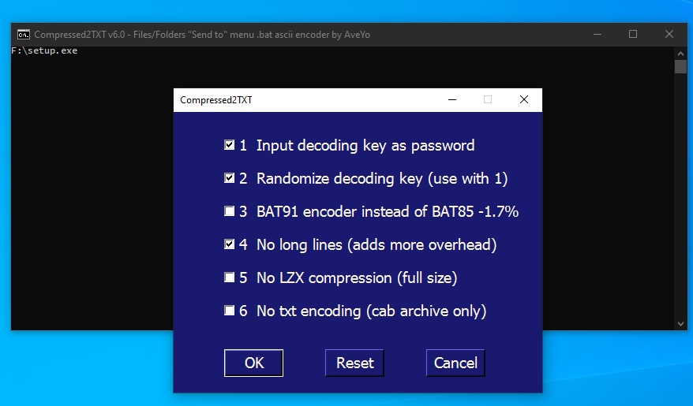

# Compressed 2 TXT (formerly File2Batch / res2batch)  
Windows 7 support ( PowerShell 2.0 / C# 2.0 )  
Very fast encoding and decoding BAT85 and BAT91 classes  
Multiple file(s) and folder(s) "Send to" menu selection  




## What's new in v6.0 final:  
GUI option 1: Input decoding key as password - saved in external file "output~key.ini"  
GUI option 2: Randomize decoding key (use with 1)  
GUI option 3: BAT91 encoder instead of BAT85 -1.7% size but uses web-problematic chars ``<*`%\>``  
GUI option 4: No long lines (adds more overhead)  
GUI option 5: No LZX compression (full size)  
GUI option 6: No txt encoding (cab archive only)  

__::__ prefix to disable syntax highlight in advanced text viewers is always used  
encoded text is either split at __128__ chars or at __<1024__ chars to keep lame new windows notepad happy  
improved MakeCab ddf generator to handle localized and special characters filenames better  
two pass MakeCab to reduce size of filenames tree as well  
improved BAT85 encoder / decoder and added BAT91 alternative   
improved handling of multiple selected files and folders as source  
prompt to accept or change the randomized decoding key  
original cmd / powershell hybrid; script-friendlier $choices variable; fixed Choices dialog 1st run warning  
perfected handling of read-only target folder by saving to user Desktop  

### More about option 1: Input decoding key as password  
Yes you can definitely put your own / reuse a randomized key, that's what the option is for and it works great!  
but it must be strictly 85 chars long if using default BAT85 or 91 chars long if using new BAT91,  
and it must use only non-repeating characters from the base dictionary.  
__In other words, you can only shuffle the characters around, not add new or repeat them__ (without editing the script)  
That's still quite hard to crack: 85 or 91 minus 6 _(MSCAB. :D)_ \*factorial combinations!  
Reusing the key is a must when adding multiple bundled files in the same script - all have to use the same key!  
Script will verify if input key matches the length and base dictionary and if not provide the information  

## Typical usage  
Used mostly for sharing configs / scripts / dumps / captures as plain-text on message boards that lack proper file attachments, or to safekeep, run multiple tests and sharing binaries in malware analysis tasks  

To prevent copy/paste line-endings issues with the script, use github's [clone or download - download ZIP](https://github.com/AveYo/Compressed2TXT/archive/master.zip) button  

## Uninstall  
`Compressed 2 TXT.bat` adds itself to the Send To right-click menu for convenience in usage. To remove, just run:  
```bat
cmd.exe /c del /f/q "%USERPROFILE%\AppData\Roaming\Microsoft\Windows\SendTo\Compressed 2 TXT.bat"  
```
## BAT85 encoder/decoder details  
Tweaked version of [Ascii85](https://en.wikipedia.org/wiki/Ascii85) that works well with batch syntax highlighter used by pastebin and others  

Dictionary (can be randomized):  
```
.,;{-}[+](/)_|^=?O123456A789BCDEFGHYIeJKLMoN0PQRSTyUWXVZabcdfghijklmnpqrvstuwxz!@#$&~
```
Encoded example of this release with randomized key used as a password:  
```bat
@echo off& color 07& chcp 65001 >nul
set "0=%~f0"&powershell -nop -c cd -li(Split-Path $env:0);$f=[IO.File]::ReadAllText($env:0)-split':bat2file\:.*';iex($f[1]); X 1
@pause& exit/b

:bat2file: Compressed2TXT v6.0
$b='Microsoft.VisualBasic';Add-Type -As $b;$k=iex "[$b.Interaction]::InputBox('Key',85)";if($k.Length-ne85){exit} Add-Type -Ty @'
using System.IO; public class BAT85 {public static void Dec (ref string[] f, int x, string fo, string key) { unchecked {
byte[] b85=new byte[256];long n=0;int p=0,q=0,c=255,z=f[x].Length; while (c>0) b85[c--]=85; while (c<85) b85[key[c]]=(byte)c++;
int[] p85={52200625,614125,7225,85,1}; using (FileStream o=new FileStream(fo,FileMode.Create)) { for (int i=0;i != z;i++) {
c=b85[f[x][i]]; if (c==85) continue; n += c * p85[p++]; if (p==5) {p=0; q=4; while (q > 0) {q--; o.WriteByte((byte)(n>>8*q));}
n=0;}} if (p>0) {for (int i=0;i<5-p;i++) {n += 84 * p85[p+i];} q=4; while (q > p-1) {q--;o.WriteByte((byte)(n>>8*q));} } } }}}
'@; function X([int]$x=1) {[BAT85]::Dec([ref]$f,$x+1,"1.ca_",$k); @("1.ca_","1.cab") |% {expand -R $_ -F:* .; del $_ -force}}

:bat2file:[ Compressed 2 TXT.bat
::I#jg|11111W_(/#11111NVz34111111}^8^1ll$p|r4Ni-Z)0C1llZ2;zVbs1111111KT6Yl[4,Rq?}8B|D3$,{0zA;zExbMs;UfEJ1R/-{d!.11KB2tG9#h9.=HmM$nF$i{I^ja!6UWP13xrLHP29mZ(ZGwc2qfA5O9#V0O;rD47N1)u+{GI_jQ-KtFc~~2Jb~1llApwMRdUS8LU+V,N$Ucc+9&Z(Z!Sn2di]g.2Qb;g!N[6ck4FO0,2?y;#m}@ixpY-LGVi$,h[TUmib/7WKqoT$0pI?jEWcQ)=jlE34J7}DlZy111)pP[v=1,2ww_f6vC3oT+IIU_XxhT)I#u,?/p{-]ImC2^L?i=rHqCaz[3$6w~853=0lhOO{W~}Dn?lG,GTfhyHTaal3}MzN8!ojHI98s^pJ/V|nNZPp~n@MnT93?#S+2Tgff(a4|qk-ea0uOu{DDS/G^dax_hzXQUMhIw(R{2$f]oTo@q|11h#U4cB?a~gpHA)TW5n8EL&7z0,8#h1UDY^kKn]TapIhKp(Hkz+h^[Q0.Hr=cq-GGZYFuf+7u;LGc[BzT5-v&J}STFvWsG)]YjGY,1JyJx=Fdh8cllnP1wUVn&aDMRwnRdM+&]|tLTjlds~g])&;6v{mTAJp0q{;]mPs2g1l@rS^l/ylmkj&r+kIK)MSeghAb9UH}u[Mi,uQ~U7k}?.k/8qb)ZjpZnJR!+jtU?SC=rNzsxF&y/c9KZtg#zy{q(apkcd~s34NUVxv;Pe|/KPvsdQx3Q6BT^h.ovARF}=3$CFjS_Da^=iYYR8L!]o;sR;nlV[Rj#|?Y_SMbEPJUzI1OV4AgX5itxwhe|s{kx[nO.]HHOPwymHeu3UUpvGIM.nvyzdmxv,mqRtI(x.Fc43~d3jhje6_~LfM$F758$04$)O;O2~RO)[53Oe#SK3ucB!Y}s^BHa+2Y6WCc?pb({340t8EL0tu8=HT&j|a5k@I~W}yec5xDr5+kY6Q2hlnL;;22I@Lsk|WuopMr3g&(
::@+Qcjf=_c}83HO|2YMYleGNRTM@~-Vf0T&m9jnR~KZ$(H&qWVsFD}0EqBz[s4{UT#IOo&RzrcI8VU5yvHyOKS1$y#K{KKy6e1K7!{&{.2ozaA,1b+pVQ9wcpkVojx&Tc~PbPJSio/ufP3!ikkA?5dV1kD)o4OoZBX)S2hB?i|2a3uZ!h+!WoF]nj+q+m/IMU!o=C/ZbCA&7rQMA+Io9r[Lhw60q[gN$q_vOrz-aJ+VdX+P~Q6zu}i4nuCjTn4AL2x_bk]7K6T/7_V1J|r2]NX^.Ua@M1ro)[6YZXXgCQ4#w#pF3bU@urTcV/jxg@cwQrX)#JgS1PnU71mvAyO-Ppjz&SUw@bYNq;yaFZ-kwzRq(Xlg7/qB-Xj,2#@eUQpctK$n0_/W,2Eht7u2.=1/|^l.64!7#M-{nbL1BIo)H#kch^ydTwdTZ8$c?QERiWV^Qk3Dl$)4h3Q;uDx,8e{e#3v$Lb}f{-_0XwpaPht7]xjUQvsk!,NEX.&=wuqCNGQTp+^7O,D+zk3!=P{GPawR#-}].PLE+JYlJtvVY(PvzAHHh-TWFo]Mt}!-)eLBvRfWRir2ii+W_Q1=$+u,RDcfXN2slk}z5Q4v;juC4oTX@Cf$Og+!w=3a;0_p&h?MG4htS#GSrfWSdp+!j]Ej~r![jS{X8MwfvjXbEoiSBnY=0?Qxj_F?wJ7s!UOc1D;KTVgQ|EDvOQceZum)R$!@X?-{Q5-,gstS@zRqF3)=fjn1,aQl,_=r3JOdoHYf3_]B)[xI[(mINn$lFtnsQAm(OCq^0cSc/v$,xheXBnW&cV9_=Nwv;hTl5rCx]xnx;&rwIlNiAj^h9^7q,kE&fW|UTr=O|8RaZ/)=Sh.65qq#kF=5LaZW_Q#NTGVq61-?B|1l8GxZ|_S7v~JDfxQS=A)tVDQMoyWq5aIZ|7{lo-.Z];-f}wBl[,Ho@AM-DTId!Daz$pnuRDLmt.p{tt)J?mCB8|H8y;TI0#^x(&lt#6heqU7a)}^xx/5/m=g~LkUDq
::UDFy6qWBh^x.pmP.GW&x#^&ftUXkv,=7Fsv,kdXumfQtNyevR6;[ovp2&u6CQ(ddB@fO$_T[&S[sLKR^WxVU8cq.t0M?G2a!h.lo)NX]ndD2=a-X|1gDe(84s6!_c1j6cPTY,Orm=lHJysz|uxn^JojEv30Kau2tHOqi3-OA8lC6&6UhRzM.Zr?/uF@thSs3al2$sS5WYP)qSgN)80$~j2SUm&R+r,-LNyT0,qFob4;R,,nt47EGz][@bD/Nl~;!i!W--)Ik9Q}Dt+w68[-^/i4ucc4Ny6.Lcrj~KJ(lw?Ep[/xmVjG=#=x1}mY@kI&AsW={uCVY$1W8owKcC(mxPh=rn1l;ZIORhI#-)g-hzN([GHl|X)1UOOw;^}9Yk_gwADRh~esBd!-cU8#6M[j~e8Xo5FV,U4hI3QCx3-qU{?10jOG6pK-+5I0gJgLdCq^&L(wTyEY)PT,$g#HCZ/vB,4O1_)MH,T#!,{z5|eiqZt{/+5R{RP@6(t[gfK6Rk^d6-J?mOO?PYJk_RZW/_WSwPcW;bF#GIj-]4I#n]CLQn,c{se&$V)k}go^P(u3WmvR!;CRny$2FCmL@tg!1UN-j8JN}U-p!gx{f4y{B;!dkfVYlJddao=+TIKh9qHbe].9GHB6Yjrm0^kpngU!b?CuRQb.nHrXuL+}KE=M#jaHQC!{[v..P.gNd#Yl9=@/qvgVQEMxx7l2Q3H7bbAD?h7+UfMow~(Z?hZY+B~+9D=7y1l6EVL[{q4r!+w8)+P4ayC+Rbyq97v=C(byh_6}_m=KaA6SyWKozByr=S+ZBU-6.Bn21hdt(V~C{(vHI7sANY]at$XFCu&b_W5y(dS9yn1JzmI;-f62i-RQlv&.NvBvhkJ_UE~.@_-$y]9@g},-B5f0Z]#[V4IebJWNVwj8Up}Xk{M|9D/&2ND9[0awmzn{$FQ?aI-wNE_.v0NQIAh1|P#ihzHw}gDtkc$4OARcg{)k|B(a]bwrhTUUmgE]LcR?bPLU.2PbyqmF]NL}
::#Lw^_I4PQo!?0-es(o&M|Zc1}vucq66UhJSBgFJ~9A2od^u[3etj4Bl=Q,,V6O8q,eNSUyp?P_IISuL~yK2UUlMZo03H=9,waj@uK{v9.ghv$(^c}$O?u[k)vHVHgF9hD|aWgS/lubzdZ|2A-(H@vMSZ/RE49[js#1l7d_7iqV5~CxTw=zUF5s[YP#Uf6-j7N!1ATfnsUoW{}+pEs]~B#mn2fb#V4dX09LVj&w5h(o,Lk1H+n4lE}S(8{[bc7.gd|nr@/8qN-,8#mB).v.4K_sHAtDE-pk7@/QB.}l9;k{o=oF/g3,-7I3QQb{tay3]3^c/9nTw&DqAHV-Q7s2gfHhB/@1SsiN)JxKXC@nJ{[^5JE7$PAhBwJ4hMH_HZmccEYw^7?6U[A1{C5}pw/|[ma)DEY8Va5s=#c-g+]8Ed}dQxN.IZ#b3t2t#zhTKZki,a9FzC?4qovU{FykeB~Hd4WO9t6fmp(Q0ac2I3IdUH)fie9v)@l|y1igrinD3F#/D)Yf?Gtp@ZiR[RzPQ/HY]hoyho3C!Fc[ebn,_0?l+}]0d9wz5xn^JsV/9dl6zgvedKP@0jf3W]Zx]b2zLCau~zY5zKzsGn-t1!I?)Xs_l@Mk8B[.R0g;((HI[@[PId&cmLK0H#Z2SV$a1o|geO.FX^R3Ju[hhRwD6pnJ5C9E9lLoP(jkqxz,n=Y}s37LT4,W.@0i~ZD)t{2FQ$P8io9l=aRTcM@HEEV};!K0GFQG$-=c=A9kJXaF5BA/U,ar(QLACz!]3d_OgNrbnD.)o-)]|tCm]{esfE?he-atz#7@v;E.o_iPh7W4td;&Ylsd$qEjySSGoo_Y8zJ(E&E4^jFP20G$#;xnA^htsm9lqAz-|O[|{[6VA5qQV)CFI7+{l]/lJ1kUQo$)OW}p~yEZO;]_pf]swO2!ip&oTZ_J4.fu4|k_(RZJ0Q|6HE=RcRwYN1.hdBW0p9myb1b/mSGE+$O?}Zt)V439jK&OR4[F;MX=6z,cAkTWD3Y&rLcMi
::KV8bA-HR)W2)w&4BsKLzV_JePm-C^FdL(^5F-Gb6kwjRD7t#~~&9Nz6KmBaK|UJNT=JF+bzoz$JTTMz5lFE]/?u7w_oIRu^Ktc|oJ{TGPt.RRARo,aE;4m,i+UfU-,z|{(3HtrG+epU!@OlF/7&Htq=e3]a~0H?vDge6;Yt1DzwaXmqjM@GjN4?KpsFU~=C#m69iIgi2r=mOpZjJ7l/UV4_EmA2c=HdMh7&&6zW?#mULVdAD1=3z7{$oBiO}]7yXbaRi_AJOQgbG$d@Pkmpfd_LdW=|4X]Zt$i[8@ByD&uIBT5H/^|-Om4iszyoCswem|r#(Pz6breXd(Akk=bzLlY$({$3QI-Y|SW8MaSOUR8_Qnf?U8sVNZT/~9$AbiPMgoUDiaZ|.WEq,ZQ2Qx@Y9sEgWKHm;Ujq{,RMymag.I(ke7q|G=fM!f18_P59qSZ6_vc#Y3~o]u9eGr+Ks&Xc&#v9t]W,|}4zr#4&7A7~ctt26zQE;k.H,[Q{JvYD{Txqk#ZU[]glyTg[wsSY4BwccP5R}Z6bcgC3|DNLJLE/_KckQm-$=TT4rn.Cw#YmmG11wc^ib9(j7ejau)vN=M2gx-upq4P/CPP|?VTZN!x^!r^A2v2WG}8t4JDdB3X4(N-PLOW/ml}1xdc+.=U{8l,T0yL.gzw_V-P.v8m^G?;Ex(m5w_C/gjeKI{N]pJz9UDU#i.ijN/JD?#ONm0R0KL,tuf+-w}Z8hBjd&K{R#I$#-}NS8/]|y5H199-/zpDbJc~Nh=s+Jh?X=[W[&HhfN&]-gR|1d1xeFu(A!JYi?^GKRpP7e{E8iK9v6r@~&-v+v^.4^2!94u3ub79!.;~9r~Bc#F!^TZ,-W6le$GrVvinh/~?c$cPo&TOQvV7Y{{2h1yiVUp2k$bJ~JP;QF+[x.;[KTD_vmeLyjri8jXQajwj$fe[diOQkpO{@,Z7{bmocSSAx?-BO5D&agHyK1M_b=1KL;((wR6}^J^rcdOrWn{W/eQl!XxdtbKn!rK/8
::qR|Z-aCGEjY6&5T2=j._huIa5y#x+I6)WDvcbw-u=8Fg#Ab&xMZh]sIB_w351b^5B&StB1P9$c_8H2Z1Hxf)7Zo]&bwps#FW{u,}wSC,1)a?e}|gwD~?|oY)U-t,}/EIvLt/Ugy6xBH~f_C&f7a.-nn(t7Y/Gs5|_~a|7=.Wul,rVomWpivm@7M,!OusmX^&sJ_Ww!7pKL/2m$!@s?p#p#s,eC#SsC6.no+qC-MiFb!Gl21@hQ#r..Kvn0$I),p1RD(gkGmYb8r=JY3kY)L~Asbv49)twGpFWxBotbNKAbgvkq3h-_SdTrXUXY+cmjgBiY7|HZL-k3+aZ8Xs5TwB})ClSgPI37zgW0]pb7+2@Ja][24e.5b|hZG_MFAq=}w/eihp[LwpI$MBZfJo}zq&y_Wu/EBcYw9ydEleU9xo8$=i1@lQYz~bIjcK99YNIP[pvCNj|&VJ_p-4[Hk6W@3ig,^$Wh?FxOO-|Rm_Y9Aev}_q&)~,$8#x|#l+GI8Urjl[ywNI;v@(]fl3!,4WqRt$L@R8LuwWw3cT&]]8U&7_;RHQit^Or6,6+^#L5R!rdZo{-bCCr=0rpbhJTaW|/T6N|eV6x{L~Jv8a0Ur#Bb7wYm&#R,Gk4f7Fa2PS_[+TxW]@hr(g|yvRF1WT+=iYE}91rhyimq}ulL,b,WN=0.G|egMoG5m]O&esX$oM(F[o6FHS@!wbMIa73GY4BxsItIUi-!!BNMk!)_)&req}L/FVL&0g9,^MAx3d}X}S.W$Mnr|d9|dkpdhKOQk=U!^{rJ{iYrYPo@P$q2}uIc]{YS#wx5vg7R$DEC5$n;ltUbRdUntXRBMnu.NW1V2w,!PpErGC5+va)EM|[J(vyTOSq!cxeI;TPFV7o)XULL=l[;~F,W+1qA6sBO3{hQ}gJ8t,.g?X=!S4AC5SS2bM~1nvKar~8tT7w}G9Qhk/aZwG(v7Cc+/56NM?@=7}^Tb.qgdHPq33t5u+2IkM~/lO];8T@PaLvZg9dOu|a(Y+YnU
::-3D_1|QLuvsmog}y-FH9_IRv1QfGr4_H,fQ#Q&,?1CLv7/T6d3s2M@S?P{tl,V@fP@P1MFm36LY(lq6N?dW!8##2iUg|LG;gTDIYdG|q/{(P!gj$NGOnqSXVt;4ZQ?AB}$S8WLa@=B,gQ}x-6Wpb#Y&?4QwX.g(,;j7feA)~1V6Q@aG7IP@YGG75!hE|50kgntVB7K6.h8J[~@FU-u,fr)DyZ0ci4)B7X=.d}0=L92}OxNxtE&JcCB/A-F+(}I,#+xE]#c[qRpLCn9OinEHg[?,77-P^fU!fP|iJ?u8SDyhj=mW7UQFg^dlWO[7=e]qCFU^XE](w9gq]26zHbnt&2!p7gsZvQ[.jxc[K87I]PVg{K,-rIhxx#$6E/8_/&4#Nm!~6ye]zl}1VH+--Eu9MU;;2a{+l??9J8Vu+]u]Dqv5fdx$C9EiL2y(cX/ihr8FyRso(E[hm7)&l~?H0-1eBGj6^?R-v{)+it8W@$bC;XTIX4bVv;Plqs^OYJ#2({vUJJE57SyEFDriLbal8qIk(+2ahW[[7Z$xYWOGt6)dxICYZqrYQ#q!@/r^V_UiFKBes-h&Tn~,of{HzDu$.rL}.dW6+&ja&y.C-wAC|G5aO!D0e87{iBVOVun!$X|WfV.]3{p,.CCahM2+pEv!NH4g?aRK|pQgrO[smmp[JhTBzJ}=eSh5dv[hEGw/9CNH^p7ji56[Oo-,+-bwTBu=Y9d(dmC(XY7PnBBse^x/s|/]vUK+aYMi]wj~^F3Woe9(Fs}o_y=8Kj,;{rp=0i8tQfzj9R{pu&RA^A2+G
:bat2file:]
```

## BAT91 encoder/decoder details  
Tweaked version of [base91](http://base91.sourceforge.net) that works ok with batch syntax highlighter used by pastebin and others.  
Same dictionary as BAT85 plus ``<*`%\>`` characters that are less safe when posted online.  
Generates 1.7% ~ 2% less size than BAT85, so if a BASE85 encode is just above a size limit - 512KB on pastebin for example,  
BASE91 might make it fit, but otherwise keep using BASE85.  

Dictionary (can be randomized):  
```
.,;{-}[+](/)_|^=?O123456789ABCDeFGHyIdJKLMoN0PQRSTYUWXVZabcfghijklmnpqrstuvwxz!@#$&~E<*`%\>
```
Encoded example of this release with randomized key bundled for auto-extract:  
```bat
@echo off& color 07& chcp 65001 >nul
set "0=%~f0"&powershell -nop -c cd -li(Split-Path $env:0);$f=[IO.File]::ReadAllText($env:0)-split':bat2file\:.*';iex($f[1]); X 1
@pause& exit/b

:bat2file: Compressed2TXT v6.0
$k='[>m(Ho/fW8hF13,zA$.RO;%0kD{pvt+=abgT^w}JZ7Ec@`]2XYx<\)KrSLunsCP*~il&9U46j?d|G_qyIBe5VM#!Q-N'; Add-Type -Ty @'
using System.IO; public class BAT91 {public static void Dec (ref string[] f, int x, string fo, string key) { unchecked {
byte[] b91=new byte[256]; int n=0,c=255,v=91,q=0,z=f[x].Length; while (c>0) b91[c--]=91; while(c<91) b91[key[c]]=(byte)c++;
using (FileStream o=new FileStream(fo,FileMode.Create)) { for (int i=0; i != z; i++) { c=b91[ f[x][i] ]; if (c == 91) continue;
if (v == 91) {v = c;} else {v += c * 91; q |= v << n; if ((v & 8191) > 88) {n += 13;} else {n += 14;} v = 91;
do {o.WriteByte((byte)q); q >>= 8; n -= 8;} while (n>7);} } if (v != 91) o.WriteByte((byte)(q | v << n)); } }}}
'@; function X([int]$x=1) {[BAT91]::Dec([ref]$f,$x+1,"1.ca_",$k); @("1.ca_","1.cab") |% {expand -R $_ -F:* .; del $_ -force}}

:bat2file:[ Compressed 2 TXT.bat
::pKVx$[[[[[j([[[[[[cz[[[[[[[[_mW[a[[[1vk[[[l[[[A[hmQ%s8[[[[[[[[4q({d8a[CUyg*/Y%,M/>aL0?z^1`-wv[)0O>2&~Xz3m[]#337IZ<FKl4+e9DXiFn,n]9Q&1J/,(Jk_~l,K>qrCQn$.xla%H|/0ac5|}^(%lcdVL7[.~^h[]4A[n$>`]SDw4i{3htQiG<?7[8e!zW\p?)2R<he\x}VLk<cj%y`833ZM{&#HWZpiM#c;a,FZ[?xOt8_>_J;?#DJO@|H6(`#\[=aii994c^#@d2?m~[[[Vv114vKByru#){rt(8zsptioJ>A`[kdmHmrce%&Vh*K-nX^/(t#lRF9s{uG|b;~qjlj)V|`;E%;e#yMGsd$!CK?*u--b0S`Yff@\vgcFiFEm~@-IhkjZ$bV_E![;nX>-&`NTr(.h/U,K8qck2Gu%q]$nJ8b`5/;s>w1z1O}>.fo~fp}[nk7TJ\94DI=vxDeCo=0F2S^K|2ubvzdmCLD;+/nD#,#3@Vr&|^~ty-0D\XJ0iXwL5mby_.J,UQ,,EyzKKCFj\s_]i9X9d>ms<ue=W/YK,7SPY/s^(]A[h<LLu%[a#VJ\W1s.r1tu1s]]ug!ss9qqh/s0DEKl}_noDdcS(!hdv}YBC$&4eU$7%e4#kt)8V5/KNAzmfiXK`,@LITrt|3vYN8^?O!`lk8y;U6}9@F_(N&oxNwJdbgbNoD!./G+Pl)}I3AP}tZH9b{e;`<%\^Y,Ix?Ef.X]v>Smn]F<.MEekC@vi,f(>7>q\#s^XsrUve{~+LDbo3s#fW/Bj-[nRa!ni<JA/5os\hPGy-2R?\VSN[RI3lqiTR(W`7IlCYY6*-Hk)n_]\lxh>XZ>Z*)\Fg3(,wD>^rlbMu;W//DSsgH`Z`GNFJ*%HB6UwYb5^|%4yFjKAY5@%_~C\~_mh1kk[JkqY\&cFe(k[Rx9*2ga`&#gz)~aQe!RjawW|ohDnE#qwV{>9R!6RD{PH&O9T6^w?~i[sl?\Bq7#cerSR
::V&yW@uGfcbEG0Xk8eqHjTK|vv.VRC%W*DF><yH/t,^HE%N#mnDGIMa]0eD$`qkQz.y5})_kVlfi80U@u%x#F8M=;t;~V+8ZL1j@?TmmI)\wch~*?3C@+64/xI8_/J,]%ZnGv*w%zNLAObKaxds5]Q8)g%QB},weioY(kXBfHq`5S}lhK9fRQL/!D_R-*o2PX{tk8h?J{f2Z+RR8s0YQaE|K4jtf(oXKsv;~/J1@)!hnGKcL`+?Y=b&z3Z}I,>GC8Vg=T]S&|MarwSkO(|;?rF8pJh,2?.Rr~uWj*9EF.94~BV\[B`Qy,Xqj3G;WGO,%974r<%}a*))]E9Z/JiBMb`D~;xJRA%#+/,Fwk[T,Zt]5hU+&rLoXZ\5R*pZ)2+5u.>+-.veDv,}Z7,(c1r@80qaI;8o`Fp1;W|5~XziU`L~p*1v(G+MJIu8PuSmNmX*U3aJMB06b]Pbu2Q{UBkaw=V23f;j|jZ{tVc?Zlq{0HB=l6*GeZsFu*}*U%^^o#wN|@3rj5H`sd$$W\ZRKf*/u1nl]qa?,*Nj7+{l|l~Kl,]Y}rH2tHGT}b29#p62Ru\rjY$;Pg;rpG?g6M.<WS_o~`0M}WYUN0b.bn4d>wP{xp,*$eXE00^WW,w/#{]u0t0K!DZ}B*I.oe-\>j,lf^=-O&k,aBM.[#4I7^2-spGZey4HQLp45z=RM%U[y+Jrz~eZ0vmX_9n\xq7S5j3$2w0BZx@FL,DnB,Ktx$An2>l9vM=C4xLpHSuy^M+_3uQ+f485la;LYi8OoQ#TG~.IP]BC$X~Z,L2#2E(Y+}N_ma}iZn?r>Vw>N.QG?S+>O#F=YV!Ig9h&/l+lCveOI*Lms/3yOL[b6<(5z%B$!8[atcQK]x.WY(At;l^Dm)hk_kww$ss+Tlvd*^1bjth3O$orHCB\(.iC?$2Q2IJhoj)]4F~cMeVaApR70#a[-<zcn0lZhCdBM|*GKBSE7EBY0GqALe%Sj=*d5`a_gwtyH|gqIars#},j[njQAeh5Hheys<
::;u*viCqH$S@rjuWER6.|/IICWD[3DnAUDfNJR8kr#m@^o0xk#]aCe_Ra*/*?l*ygPSC/n4=%d>&RNv~GjthldZn15*PK[z8$p<MxtiT{9{~CM+z\HsUv}c26J\$/e,Dd,nQ8U5v(dtM`Bw[nxLSVv_pi+)k.)c/3UaYZ;X,nH~B\;v3ahm]=8h16qor@&]xW]#eGs3^2.#{+H%CJSkaBC[v;s@LHDq%qH>r<3AbO3.EveUj^bS23jRUb@)?jp|YsUV{U`yqGaHH<Hd<z&d#<qAiq,<@&yMU)6dMoe,;Phf&U+yLEO{&rnIgC1n%xL^D]@s/a~18Lp$*CBw;^N-5y@^QmE@<QDGZF.wVShDj8%rswUYiC&oD)pdbU08EZ&6z;Vs;?GQ`V3CdMkp-AeL,E{=Wq*1B=[/%rH|};Kv2I>w!-.&y=rw;-@sUFYX]@Y{tCOp-#wkwxf<CH4Pu`FelJ{Gu(qYI#CVlrq6b9,h._pcX.X<Qu);=,f0!\!z-pIDz}r6qOHX#Wr_JY3k1+fsCcJ`kaDWAnhb#<JQR->(<e>(\EE5%ZPmz(k^!ssLYsCjQ#gC3X[tu9[)6y?DzQ)AjZ!y$?oBL`;V%PeX}#IRLZsnks!9sB1M`dEHf$VtV[6eE.?()n?R2T6*\O;l&BBmrBVbV0n](*Y3D>8k-_)d.KY|t,3~O*`;nHsu1iH(vtjN8X^w!zOUD\TjU#uzP%hp1Q47(Qoc6`Sw^5h$/t[{$Sl/|AgoGhF}<~1yc0c3KRNp-e&Am8bLNn&/tf,=wTcCT<?W5#TBIs2)tQf|$((e/1_z9jl0#68c<smeW*>R]IgQMmbI=Uki_]dHXfo{Ni3en34S4L1.*&&v4uz]tT)eeT@OqJK<MF6x*YTB{~k)R*T##{+]/3g6t&luX`_O_W|MI-smcsKbVTOtS5%GgFU.2kq=&4*uBT&(bb/dW^j^7G1k2KOw01wXP,[n>pr!|.mYai3uo+z.vvm0D&j_kMG|ZTpYKL\IN6n4/Lq@\W
::1Rb7//1&lc)hGl%-($v(9{Er5(\.~Fm~=t9wmK2zs{H,{7+@\9)$$*n1_M0P8!mghjdCXmi^I?;DF8CgqmA^5}egt~TaAjHOm=n&<lK1i5#L,Xv7kO$1c(G+wCVz]5ecUVqH]Q+}07v?*4.X{s7s%QvkjO0})#Nw.!y8I;u?h6qdb!Raf;U[u&p,l0Iqf|I${F#X$^L-VW-[VUU/Ijw%n0*HdXu^<^]N#<=^38FIw<fG/yXst&zUETS|Ro7$RULC7hV<~h!1t=i/@rF5gyu{d1G*SHPE%j2!S`QZ5Dba`H0]Q\{5#[q(|ioEiX$\rs%Y/d[;lMnZ&T+ydz0}-W}h{<-78#aguUSboZq03,1Kw)8zsls$T~S~,7lzjyWO@m6X7et65\\0DSk^Jonbp!u$|F^yT^{KeP[}M9.|<c]C2G%DIoVf/vO6$li\9/mg/7[1?f,XK[Y048$WshFyG8cFqg[gJMS8e9`{&]\z7E3fc0eD&xSp\#BDBTG|/!GkQIGJsRXFu*jgL~aKK+JR#~Et{29~p=PmTXO\^@Go#(mj#%K!Ny%4m)d~k@PdIJQ872]143l2ADRG6}1O2&*5OnC+hStuLKdYe(B`G(qBy\z%YW_~-`]Yxf02AIBOgu^k,l/*=xUeq8E3P>FU\yQ;#vZPF,xy==t}@49m0RYtsqRtd?|K9ZeknEtgg+$nS5,O}8B-v{>avgH~(r=6u5b[$=@fmZWhxO/8^/`NnpvR0Sj@37=W<!Pi;VWxdrmlqH}IV-F(%yr4p=MXUx~3!$}H/snm}^t`&$c+phR0{>6)v9V{%`!,fJ^g8K1wR/z|MtEazCII!4NYZX~~#FYQIqgB3}=B7Lk/d-QaAD?bl/JG?$Mw<r3*SAM;EC%%dTzZF0]hMIVI69D`q7JBr5Q.zxeWb_DByPk^<A;o&^7FKox8d6te%dP4aYHaIQ4=)W1A\2}9Y*w5I&]g=5nd&BvI!_NCOEbW(1l=?4[[kMwk97n,Ntrn}SsJb^^(YA$Qk*Ml
::A>AX&$B;(gW<8p&MA4I3LlbM!4_rR4d$zh4fVyxZgZ5nvO=1tILR0n}c64rhp)i&F@L}Qdxyw,MfcsznkH;\CH1Iq$AKksy+l6yL,|}|9K>~%=|y~f4D^k%?|Xsvj]}>By.-/1LEAG/;*,,LiWAKbU*i1j9}pLH_3>5GI-Z;N.#QRn_^EIfAGj/]<{_K5-d4<93C]Z^2vctsE4%H[rR-lF^5TJ43Hc;`^/Skv>-LA<ar?)Fui9k<wRlF8kH}T\CG<0,\R4Ldv}8d#>s;JLRR8?kX7mug_/jSz]-&k%#}wG+Bn^[;{fQ$zqe^#>x7?U1UUH+c63XAWs7Xh/}lWCW{GB7NeI-@BMOhj]Dmwyozu\m3\tIvfQi>CBT~IP1f}k(aW4T5X;4~E<*;qY=~}deT5KWK?PjKC8NvMW0{dY)s%K1hyMjbb-Gu6=JYX#xEfPL%>Kr2=xqT#h<q]\0c*?J1dTu0=ZvDD-mbVA4/V?\YA0TWqEa&N<dPLa>K[i5v#odCd#lM65nes4\g[A.KFUg9l3l?B8)X?qHq7iwdk5lK9US|j;@b*a|K=z#@VXUQ4mz*=~qp0SH\>B1pc{I5l@~.O3@i*bEk<FG,b$Inb~}74^EcyDW}W^l3iPg{vPJe1.0C3qer8Lqp7Z|9{/h/E0Jn`/xs9to&ITS`egHZ{!A!(L3xN+uR3C50+]#}Ousbt|xcYc`Va;Kzn[CP!-[M#_mw/]es0Mw(.l\NiG#4n6~Tdt`>4Ay#CAx0(VO|ax-&=%f&\T$IR`jfB*u9(vwJ?$@H(;<p572STGXUTt#&3cZ1(+YJtg>4ED6PmGc&$?s4isXS*z3E(&4pPtC!]H=kpY4BuGJMGInTuM,MgylF6kRW;C5AH%wbw1y93}gh*YH6LPbzSXW$8vE$YT[BTPOGnp@E2QCG~*KSnPpr.&iDb-PuX|1E.0)goni5S<WD3fd6ckUI<h|(8FDaNxSs1\iciSViE3G`x72H@HE#t}yh_vYe[&y8O)3OU7s5~_an
::h@OHTd#~1oL\_=~8$h?DR~3l(s}AshIw^K#Jm5wYdg&x$F2A+muRp#^\T#Y|yg^9GU!5gWkHM4AWfOfSSIcP33g4B6fQrnx,m\D@pmaV$QR6,cmmo5~UXj8y-qM}-6q8UFs.0u]_jW;8oNkNd^J7wS1_Ot]jw!ciA?j|<%TR7`XfYF<jS%%]`Z{M{C[3*/im)h*hy!iU!&L(xzI;2x)NJ#2R60oY<K9og>J$pu]0CC@U,$o-{ESRO<en-@?_!Bri__l>-_g,g4WH7L,WjON_uFk%)eY]Tm[-L(CcV)H`Z%YFio8$r&_57lLU8PL)GOQ{C5Uu!1YwP;3na2W-7^A8>3/-PM8eP{^2/FGM&z;zrl_x,W^,4}}U-m%JO*f}VUI.#5>$xmQVl/|rEJSh?Gho6V<K-`DE]Woq$j^w3py&XDO}u_xRRbWb(<foO_AlwS]H0A5(oQS_p?1)AxFlgYNFumkI9gSS.6BA|g^`q4}a=l4@e9flyxwC@FQd5m6]F7FzgKT=pqHb,`]b,7HnTL*Pc4mw#|zXi!lb}k[`ZSXQY9jSwha&`Ud}v]c~Sl5e7F<o\@zxVe}7~9Uq7m0F;c>J;F)!xBOYx*yV[W7%|G3b]5iS.>^Nl6xx$e<!Xx.FNTd0{T\$ATK8E&G!?,>7e_oj>/HLc}dyY|m)#LWIi91Bp5n_/PKNzo|V0St,+[hE+pj8G>Q}TdfEAm%F>AO<5]9+%K{W#[5%s-.u|(4]7)&vkW!tIAv1gg){>}XgAASosXPP0&W?l=U0oB7g![CU?#)@Q_=0g<NmQa#f$*[459k<bWe0@X1${P<6^?#8b0B+ozo!rF6$sQ0|{^.<gwem`w`/z,N-CV(9A_vS4JiT_k>a#y@/U]IVRusrC|/LZ,)]XX/qzO=s}b#cTDbGm\nlA%h1\{jW2pnnb`Hez\2xG8utCngzrB`yJQUUN_94}[jPY|C($SG,6v[CXs0GbBop>M5+.<Xr)S8%fla`=9SVeu*Vdf#p[j#RoWG#<hav
::LGG,}X.Y5,1N}?p_E|MO3iHtEwXSR$22,ZTK^FOQd7Y.k?gZ=wyj6;uRL0iB#qx3kSJ9C+Q=HwY\sFE1@!?)@rlh0b4$[rVHs0-J|+Vsfl$%9Z|h;t@86z4xiv?@p&;QT6?#IB1v;3[8.(E=^WzzR7Dt+Pm!E1%0G]1zOXcz1a5hH3qf&4rfVD9s\y!*D{pa/ufyW$qlVqnS8xW\w|73HAB\@Qe1`bhwz3-r)/}E;6az^JA+tQj})YEJaIIOU_MF&S,0$BKF05?a]/U$2FgK8}bQH2r?!ny3l*KUYsE*RUJ|W_X^5QY+FA9@S8(*6`+Tze~Rg8OWbd??jIdRDR(&Lq#RAH6Olr(XnE-$AMTZ_j45^]C3nFQxaw/cOpUE+({eMfP-[Nt9DCtqfvKE?$l0}}4?,vJ\?lz.#33LI<D$u|C.W9ji4DYCKDzbx^fxZtu4|`Qos`Snew/O.)w53ipM+y{Fs=TiH5\JL*!VAVa_v/6+;8+CjrE6oA<14@MP#<e05pAQbK77hTp#`,MjY5[#-;bGk?&M(<vanXN\@hlhI=W\!-SUh_lIeD/G?U3k#h97m)p#PBOSMZe>R`XHq+;VY*gbdcpL(sbQjWiA[tp@<eTVne@*v3LC$wNK`p\x>PNsdu4KWLw~8v4|Hj;Dv+Q(>xiJ]._Db)q6^?8gW{).HKXVb$>`(
:bat2file:]
```

## Intuitive multiple encoded files support with low overhead
One-liner trigger for multiple bundled files decode in one go:  
```bat
set "0=%~f0"
powershell -nop -c cd -li(Split-Path $env:0);$f=[IO.File]::ReadAllText($env:0)-split':bat2file\:.*';iex($f[1]); X 2; X 4  
```
Or split into individual triggers, can be anywhere in the batch script:  
```bat
powershell -nop -c cd -li(Split-Path $env:0);$f=[IO.File]::ReadAllText($env:0)-split':bat2file\:.*';iex($f[1]); X 2  
:: ...  
powershell -nop -c cd -li(Split-Path $env:0);$f=[IO.File]::ReadAllText($env:0)-split':bat2file\:.*';iex($f[1]); X 4  
```
_where `X 2;` calls the decoding block to extract the 2nd file data, and `X 4;` - the 4th_  
Tip: keep only the last `:bat2file:]` ending tag and skip intermediary ones to use consecutive X parameters. 
